# CTF Write-Up: Insider
**Platform:** CyberDefenders  
**Category:** Disk Forensics / DFIR  
**Difficulty:** Easy  
**Status:** Completed  

---

## Scenario

Karen recently joined 'TAAUSAI' and began conducting illegal activities from her company workstation. TAAUSAI's security team hired a SOC analyst to investigate. A disk image of Karen's Linux machine was acquired and provided for analysis. The objective was to examine the image and answer questions about Karen's activity.

---

## Tools Used

- **FTK Imager 8.2.0.59 SP1** (Exterro) — disk image loading, file system browsing, artifact preview, and hash export

---

## Environment Setup

### Downloading FTK Imager

FTK Imager is a free forensic imaging and triage tool from Exterro. It allows analysts to load disk images, browse the file system, preview file contents, and export hash values — all without altering the evidence.

**Download steps:**

1. Go to [https://www.exterro.com/ftk-product-downloads/ftk-imager-version-4-7-1](https://www.exterro.com/ftk-product-downloads/ftk-imager-version-4-7-1)
2. Fill out the registration form to access the download
3. Run the installer and follow the setup wizard
4. Launch FTK Imager and load your evidence file via **File → Add Evidence Item → Image File**

> ⚠️ FTK Imager is Windows-only. If you are working on Linux or macOS, run it in a Windows VM or use an alternative like Autopsy.

---

## Findings

### Q1 — Linux Distribution

**Question:** Which Linux distribution is being used on this machine?

**Answer:** `Kali`

Browsed the file system in FTK Imager and examined the `/boot` directory. The kernel configuration file `config-4.13.0-kali1-amd64` clearly identifies the distribution as Kali Linux, a Debian-based distribution commonly used for penetration testing and security research.

> 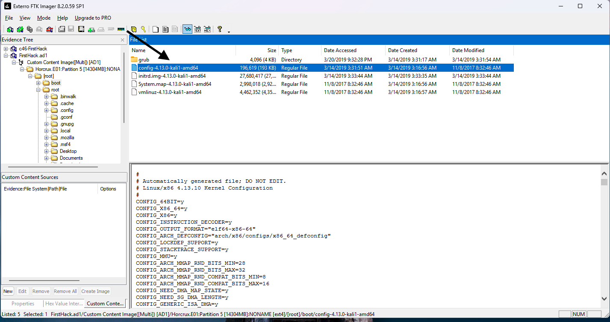

---

### Q2 — MD5 Hash of Apache access.log

**Question:** What is the MD5 hash of the Apache access.log file?

**Answer:** `d41d8cd98f00b204e9800998ecf8427e`

Navigated to `/var/log/apache2/` in the evidence tree and located `access.log`. Right-clicked the file and selected **Export File Hash List** to generate a CSV containing the MD5 and SHA1 hashes. The exported hash CSV confirmed the MD5 value.

Notably, `d41d8cd98f00b204e9800998ecf8427e` is the MD5 hash of an **empty file** — meaning the access.log contained no data, which is significant and ties directly to Q7.

> 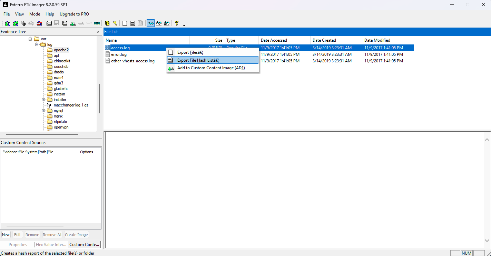
> 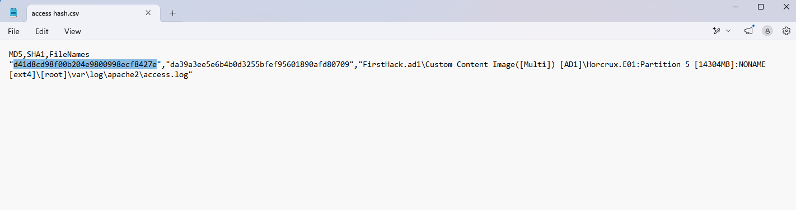

---

### Q3 — Credential Dumping Tool

**Question:** What is the name of the downloaded credential dumping tool?

**Answer:** `mimikatz_trunk.zip`

Browsed to `/root/Downloads/` in the evidence tree. Found `mimikatz_trunk.zip` — a compressed archive of Mimikatz, a well-known credential dumping tool commonly used to extract plaintext passwords, hashes, and Kerberos tickets from memory. Its presence on Karen's machine indicates she was staging offensive tools.

> 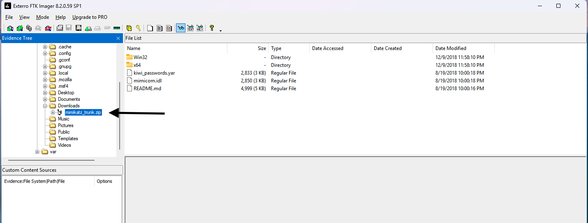

---

### Q4 — Super-Secret File

**Question:** What is the absolute path of the super-secret file that was created?

**Answer:** `/root/Desktop/SuperSecretFile.txt`

Examined `.bash_history` in `/root/`. The history revealed the following commands Karen executed:

```
touch snky snky > /root/Desktop/SuperSecretFile.txt
cat snky snky > /root/Desktop/SuperSecretFile.txt
```

This shows Karen deliberately created a file named `SuperSecretFile.txt` on her Desktop and redirected content into it.

> 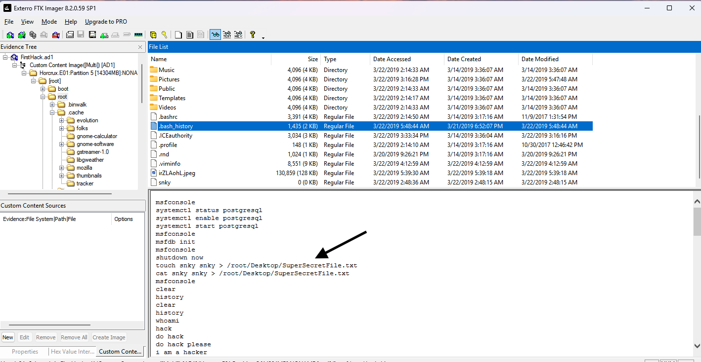

---

### Q5 — Program Used on didyouthinkwedmakeiteasy.jpg

**Question:** What program was used to execute `didyouthinkwedmakeiteasy.jpg`?

**Answer:** `binwalk`

Continued reviewing `.bash_history`. Found the command:

```
binwalk didyouthinkwedmakeiteasy.jpg
```

Binwalk is a tool for analyzing and extracting embedded data from binary files, commonly used in steganography and firmware analysis. Karen ran it against a JPEG file, suggesting she was either hiding data inside an image or extracting something from one.

> 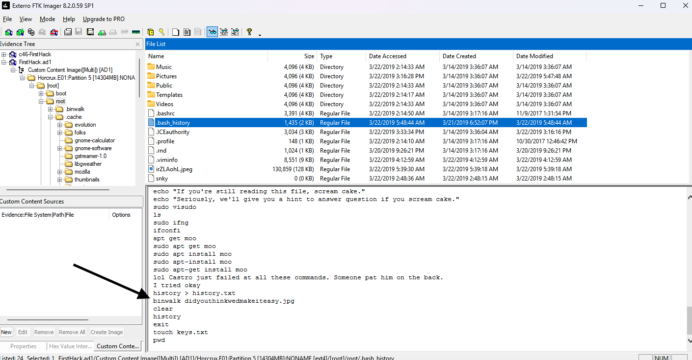

---

### Q6 — Third Goal on Karen's Checklist

**Question:** What is the third goal from the checklist Karen created?

**Answer:** `Profit`

Navigated to `/root/Desktop/mimikatz/` and found a file named `Checklist`. The file contained:

```
Check List:
- Gain Bob's Trust
- Learn how to hack
- Profit
```

The third item on Karen's checklist was **Profit** — revealing her motivations were financially driven.

> 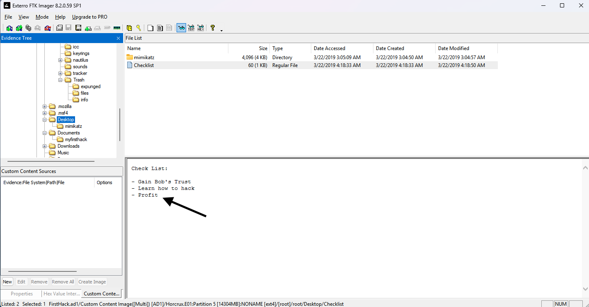

---

### Q7 — How Many Times Apache Was Run

**Question:** How many times was Apache run?

**Answer:** `0`

Returned to `/var/log/apache2/` and examined all three log files — `access.log`, `error.log`, and `other_vhosts_access.log`. All three files had a size of 0 KB, meaning no requests were ever processed and Apache was never successfully run on this machine.

This is corroborated by the empty MD5 hash identified in Q2.

> 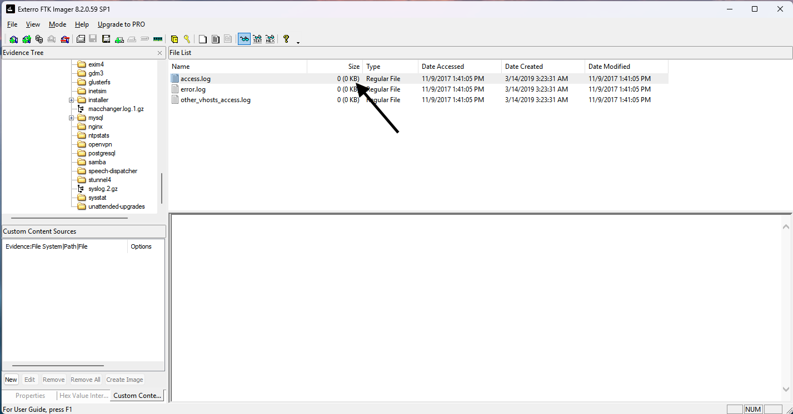

---

### Q8 — File Containing Attack Evidence

**Question:** Which file contains evidence that this machine was used to launch an attack?

**Answer:** `irZLAohL.jpeg`

Located an unusual JPEG file named `irZLAohL.jpeg` in `/root/`. Previewing the file in FTK Imager revealed a screenshot of a Windows desktop containing forensic tools, reference materials, and files suggesting this machine was used to conduct or stage an attack against another system. The random-looking filename is also suspicious and consistent with an attempt to obscure the file's purpose.

> 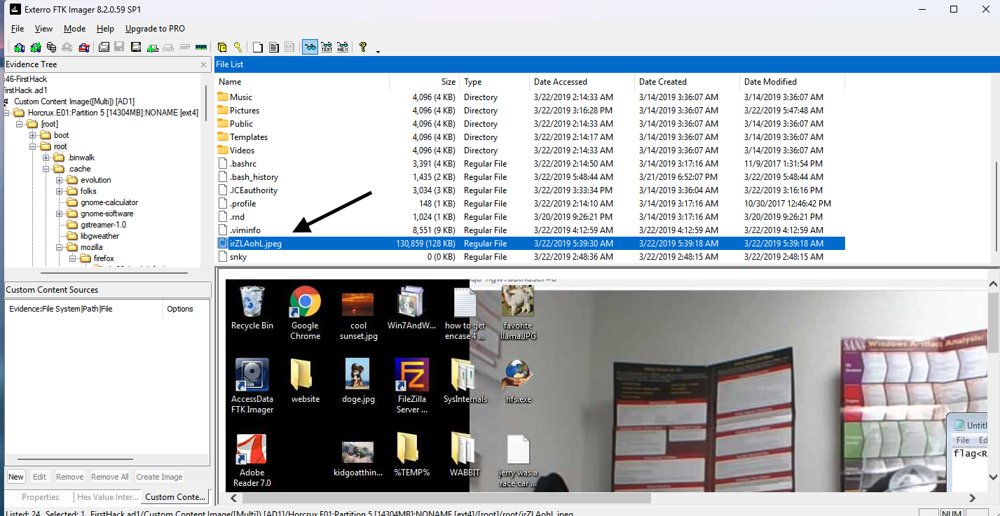

---

### Q9 — Person Karen Was Taunting

**Question:** Karen taunted a fellow expert through a bash script in the Documents directory. Who was she taunting?

**Answer:** `Young`

Navigated to `/root/Documents/myfirsthack/` and examined the script files. Found `firstscript_fixed` which contained:

```bash
echo "Heck yeah! I can write bash too Young"
```

Karen embedded a direct taunt toward someone named **Young** inside her bash script.

> 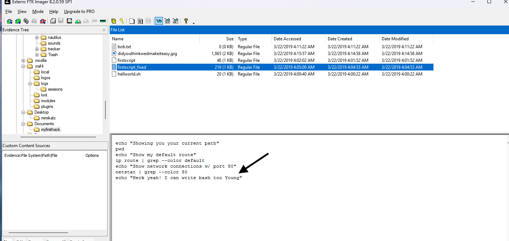

---

### Q10 — User Who Ran su at 11:26

**Question:** Who executed the `su` command to gain root access multiple times at 11:26?

**Answer:** `postgres`

Navigated to `/var/log/auth.log`. Filtered entries around 11:26 and found repeated authentication events showing successful `su` commands to gain root access by the user **postgres** — a database service account that should not normally be used for interactive login or privilege escalation. This is a significant indicator of insider abuse.

> 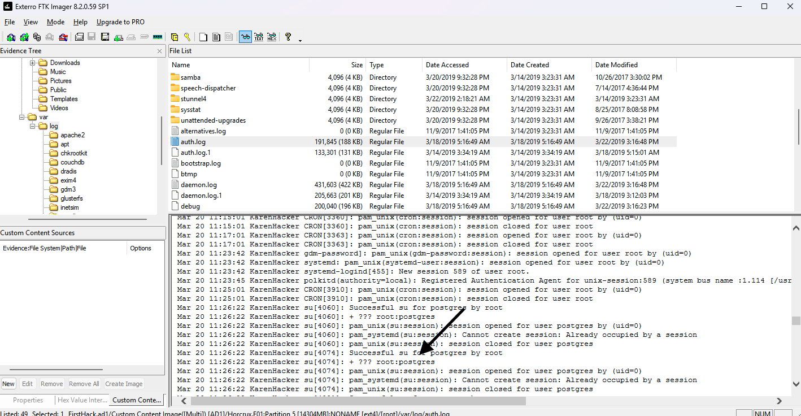

---

### Q11 — Current Working Directory from Bash History

**Question:** Based on bash history, what is the current working directory?

**Answer:** `/root/Documents/myfirsthack/`

Returned to `.bash_history` and reviewed the navigation commands. The final `cd` command in the history placed Karen's working directory at:

```
/root/Documents/myfirsthack/
```

This directory contained Karen's scripts and hack-related files, confirming it as her primary working location during the incident.

> 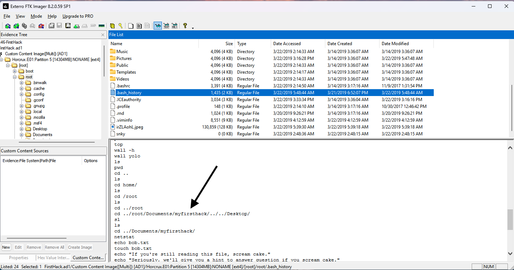

---

## Timeline Reconstruction

| Time | Event |
|------|-------|
| Nov 9, 2017 | Apache log files created (empty — Apache never ran) |
| Mar 14, 2019 | Disk image base files created |
| Mar 20, 2019 | Karen begins active sessions; postgres account used to su to root at 11:26 |
| Mar 21, 2019 | .bash_history last modified |
| Mar 22, 2019 | Karen creates SuperSecretFile.txt, runs binwalk on JPEG, creates Checklist, navigates to myfirsthack directory |

---

## Key Takeaways

- **Bash history is a high-value artifact** — it preserved Karen's exact commands, tool usage, file creation, and working directory, providing a near-complete picture of her activity.
- **Empty log files are evidence too** — the zero-byte Apache logs confirmed Apache was never run, ruling out a web server attack vector from this machine.
- **Credential dumping tools on disk** indicate intent even without confirmed execution — the presence of `mimikatz_trunk.zip` alone is a significant finding.
- **Service accounts used interactively** (postgres su-ing to root) are a strong insider threat indicator and warrant immediate investigation in any real environment.
- **Steganography awareness** — running binwalk against a JPEG suggests either data was hidden in the image or Karen was extracting embedded content, both of which warrant deeper analysis.

---

*Write-up by Brenda Suarez | [linkedin.com/in/bsuar](https://linkedin.com/in/bsuar)*
