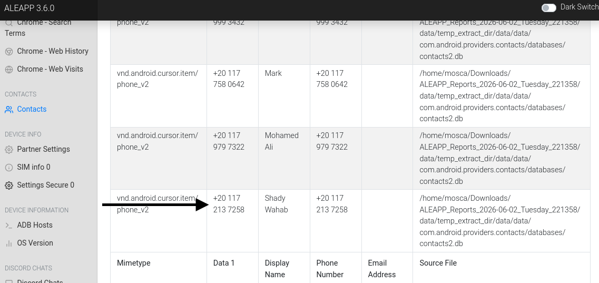
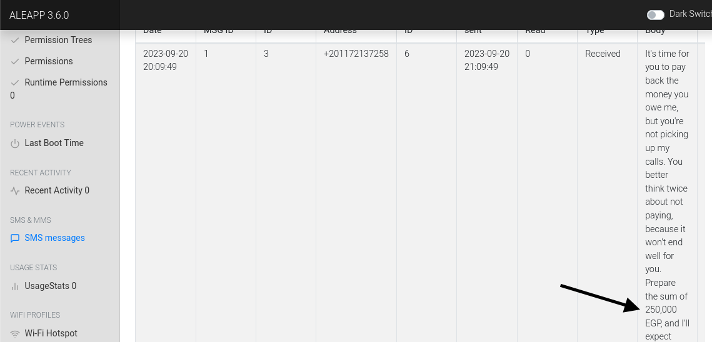
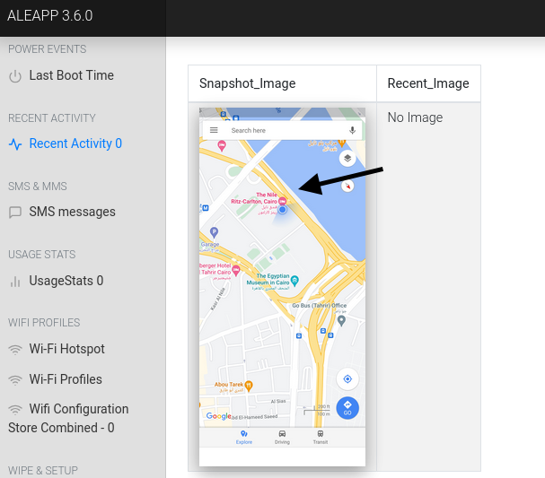
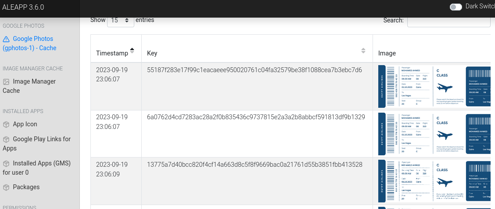
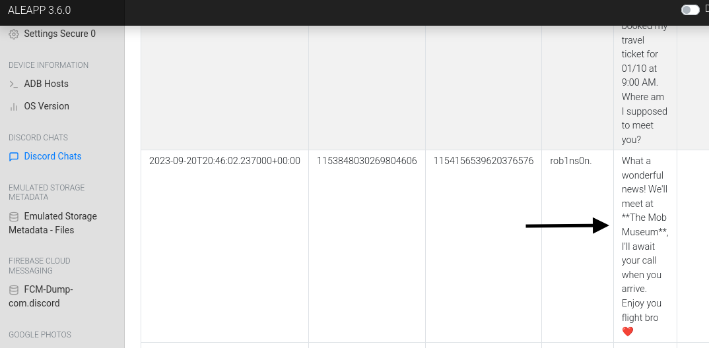

# CTF Write-Up: The Crime Lab
**Platform:** CyberDefenders  
**Category:** Mobile Forensics / DFIR  
**Difficulty:** Easy  
**Status:** Completed  

---

## Scenario

A man is dead. Witnesses and family members have provided statements suggesting the victim was heavily involved in trading, had accumulated significant debt, and disappeared from his residence on September 20, 2023 without telling anyone where he was going. Investigators recovered his mobile device and tasked analysts with piecing together his final movements, financial situation, and social connections.

---

## Tools Used

- ALEAPP (Android Logs Events and Protobuf Parser)
- Android file system artifact analysis
- APK hash verification
- Discord message recovery
- Calendar / flight data examination

---

## Environment Setup

### Installing ALEAPP on Linux

ALEAPP is not available via package manager and must be installed from source.

**1. Clone the repository**
```bash
git clone https://github.com/abrignoni/ALEAPP
```
Downloads the ALEAPP source code from GitHub to your local machine, creating an `ALEAPP` directory in your current working directory.

**2. Navigate into the project directory**
```bash
cd ALEAPP
```
Changes your working directory into the cloned ALEAPP folder so subsequent commands run in the right context.

**3. Create a virtual environment**
```bash
python3 -m venv venv
```
Creates an isolated Python virtual environment named `venv` inside the project folder. This keeps ALEAPP's dependencies separate from other Python projects on your system and prevents version conflicts.

**4. Activate the virtual environment**
```bash
source venv/bin/activate
```
Activates the virtual environment. Once active, any Python packages you install will be contained within it rather than installed system-wide. Your terminal prompt will update to show `(venv)` when active.

**5. Install dependencies**
```bash
pip3 install -r requirements.txt
```
Reads the `requirements.txt` file included with ALEAPP and installs all the Python libraries the tool needs to function. This includes parsers for Android artifact types, report generation libraries, and other dependencies.

**6. Launch ALEAPP**
```bash
python3 aleappGUI.py
```
Starts the ALEAPP GUI. From here you can point the tool at your Android device image or extraction, select which artifact modules to parse, and generate an HTML report organized by artifact category.


---

## Findings

### Q1 — Trading Application (SHA256)

**Question:** Identify the SHA256 hash of the trading application the victim primarily used on his phone.

**Answer:** `4f168a772350f283a1c49e78c1548d7c2c6c05106d8b9feb825fdc3466e9df3c`

Examined the installed application artifacts on the recovered device image. Located the APK file for the victim's primary trading application and computed its SHA256 hash. This hash can be used to positively identify the exact version of the application and cross-reference it against known threat intelligence sources if needed.

> 

---

### Q2 — Amount Owed

**Question:** According to the victim's best friend, the victim received calls he avoided. How much did the victim owe this person?

**Answer:** `250,000`

Recovered financial communication records from the device. The amount of 250,000 was identified through messaging artifacts corroborating the witness testimony that the victim was under significant financial pressure and actively avoiding contact with his creditor.

> 

---

### Q3 — Creditor Identity

**Question:** What is the name of the person to whom the victim owes money?

**Answer:** `Shady Wahab`

Cross-referenced contact records and message artifacts on the device. Shady Wahab was identified as the individual making repeated calls to the victim and referenced in financial communications as the creditor.

> 

---

### Q4 — Victim's Location on September 20, 2023

**Question:** On September 20, 2023, the victim left home without informing family. Where was he?

**Answer:** `The Nile Ritz-Carlton`

Analyzed location data and booking records stored on the device. The victim had checked into The Nile Ritz-Carlton on the date in question, consistent with the family's account that he left without explanation.

> 

---

### Q5 — Intended Travel Destination

**Question:** The victim reserved the hotel room for 10 days and had a flight booked afterward. Where was he planning to travel?

**Answer:** `Las Vegas`

Examined calendar entries and travel-related artifacts on the device. A flight reservation was recovered indicating the victim intended to travel to Las Vegas following his hotel stay. This suggests premeditated movement and potentially planned contact at the destination.

> 
> 

---

### Q6 — Discord Meeting Location

**Question:** After examining Discord conversations, where had the victim arranged to meet a friend?

**Answer:** `The Mob Museum`

Recovered Discord message artifacts from the device. The victim had arranged to meet a contact at The Mob Museum — located in Las Vegas — consistent with the flight destination identified in Q5 and suggesting the meeting was the purpose of the trip.

> 

---

## Timeline Reconstruction

| Date | Event |
|------|-------|
| Ongoing | Victim actively trading using identified application; accumulates debt of 250,000 to Shady Wahab |
| Ongoing | Victim begins avoiding calls from Shady Wahab; witnessed by best friend |
| Sep 20, 2023 | Victim leaves home without notifying family; checks into The Nile Ritz-Carlton |
| Sep 20 + 10 days | Hotel checkout; flight to Las Vegas booked |
| Post-arrival | Planned meetup with contact at The Mob Museum, Las Vegas |

---

## Key Takeaways

- Mobile device forensics can reconstruct a subject's financial situation, travel plans, and social communications from artifact analysis alone — without relying solely on witness testimony.
- Discord, calendar, and booking artifacts on Android devices are high-value evidence sources in financial crime and missing persons investigations.
- Cross-referencing findings across multiple artifact types (messages, location data, app data, calendar) builds a coherent and defensible narrative.

---

*Write-up by Brenda Suarez | [linkedin.com/in/bsuar](https://linkedin.com/in/bsuar)*
